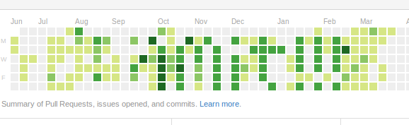

Commit 
======

Commit to fun not boredom.

Commit to evolution not devolution.

Commit to progress not regress.

Commit to change not stasis.

...

Commit to what's important.

##Quality Control##

